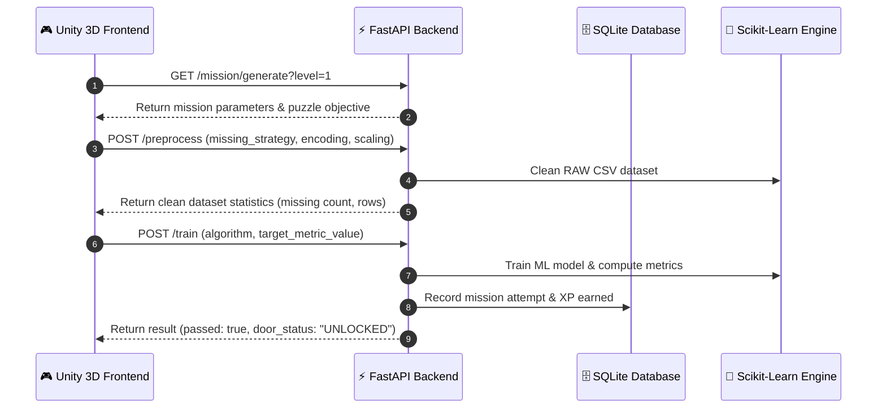

# 🚀 BlackVault: Gamified Machine Learning Escape Simulator
## Complete Task, Data, and System Guide

> **Welcome to BlackVault!**  
> BlackVault is a story-driven educational game that teaches real Machine Learning (ML) concepts. You play as an operative inside a high-tech facility. To unlock doors and escape, you interact with security terminals by cleaning dirty raw data and training real machine learning models.

---

## 📑 Table of Contents
1. [Core Concept & Game Flow](#-core-concept--game-flow)
2. [System Architecture & Data Flow](#-system-architecture--data-flow)
3. [Understanding Data: RAW Data vs. CLEAN Data](#-understanding-data-raw-data-vs-clean-data)
4. [Dataset Reference & Schema Breakdown](#-dataset-reference--schema-breakdown)
5. [Step-by-Step Level Guide (Levels 1 – Boss)](#-step-by-step-level-guide-levels-1--boss)
6. [API Contract & Endpoint Reference](#-api-contract--endpoint-reference)
7. [Developer Quick Start & Testing](#-developer-quick-start--testing)

---

## 🎮 Core Concept & Game Flow

In BlackVault, security doors are locked by complex data firewalls. To open a door, you must solve an ML puzzle at a security terminal.

```
┌─────────────────┐       ┌─────────────────┐       ┌─────────────────┐       ┌─────────────────┐
│ 1. Terminal     │  ───► │ 2. Select Data  │  ───► │ 3. Train Model  │  ───► │ 4. Door Unlock  │
│    Interaction  │       │    Cleaning     │       │    & Evaluate   │       │    (Pass / Fail)│
└─────────────────┘       └─────────────────┘       └─────────────────┘       └─────────────────┘
```

1. **Approach Terminal**: The terminal gives you a mission objective (e.g., *"Train a model to predict house prices with error < $30,000"*).
2. **Clean Dirty RAW Data**: Choose preprocessing steps to fix missing values, duplicate rows, and outlier errors.
3. **Train Machine Learning Model**: Choose an ML algorithm (e.g., Random Forest, Linear Regression, K-Means) and train it.
4. **Door Override**: The Python backend evaluates your model against real performance metrics (Accuracy, RMSE, Silhouette Score). If your model passes, the terminal sends `door_status: "UNLOCKED"` to Unity!

---

## 🏗 System Architecture & Data Flow

BlackVault consists of two primary components:
- **Frontend (Unity 3D Engine)**: Manages 3D player movement, terminal UI interactions, animations, and sound.
- **Backend (FastAPI Python Service)**: Executes real scikit-learn ML algorithms, handles pandas data processing, and manages player state in SQLite.



---

## 📊 Understanding Data: RAW Data vs. CLEAN Data

> [!IMPORTANT]
> **What is RAW Data?**  
> RAW data is data collected directly from real-world sensors, websites, or databases *before* any cleaning or formatting. Real raw data is dirty and filled with errors!

### 🔍 Common Flaws in RAW Data
1. **Missing Values (`NaN` / empty cells)**:
   - *Example*: A house listing where the `bedrooms` field was left blank.
   - *Problem*: ML algorithms will crash if they encounter an empty cell (`NaN`).
2. **Duplicate Rows**:
   - *Example*: The exact same transaction recorded twice due to a network glitch.
   - *Problem*: Artificial duplicates warp model predictions and give fake accuracy.
3. **Extreme Outliers**:
   - *Example*: A house price recorded as `$9,500,000` when normal prices are `$200,000`.
   - *Problem*: Outliers pull the model's decision line away from normal data points.
4. **Un-encoded Text Labels (Categorical Data)**:
   - *Example*: `location_type = "urban"` or `"suburban"`.
   - *Problem*: Computers only understand math; text labels must be converted to numbers (`0`, `1`, `2`).
5. **Unscaled Numeric Ranges**:
   - *Example*: `area_sqft` (500 to 4,000) vs `bedrooms` (1 to 5).
   - *Problem*: Models might assume `area_sqft` is 1,000x more important just because its numbers are bigger!

---

### 🧼 How We Preprocess & Clean RAW Data

| Cleaning Technique | Simple Explanation | When to Use It |
| :--- | :--- | :--- |
| **Remove Duplicates** | Drops identical repeated rows from the dataset. | Always recommended to keep data pure. |
| **Fill Median** | Fills empty cells with the middle value of that column. | Best for numeric columns with outliers (e.g., income, price). |
| **Fill Mean** | Fills empty cells with the average value of that column. | Best for normal numeric columns without extreme values. |
| **Drop Rows** | Deletes any row that contains an empty cell. | Good when missing rows are very rare (< 3% of data). |
| **Label Encoding** | Converts text categories to numbers (e.g., `urban` → `0`, `suburban` → `1`). | Best for ordinal categories or simple tree algorithms. |
| **One-Hot Encoding** | Creates binary 0/1 columns for each category label. | Best for linear models and non-ordinal categories. |
| **Clip IQR Outliers** | Clamps numbers beyond 1.5x Interquartile Range to normal bounds. | Keeps data rows while fixing wild sensor spikes. |
| **Standard Scaling** | Rescales numbers so mean = 0 and standard deviation = 1. | Recommended for SVM, KNN, Logistic Regression, and Neural Nets. |
| **Min-Max Scaling** | Rescales numbers into a normalized range between 0.0 and 1.0. | Recommended for distance-based models like K-Means. |

---

## 🗂 Dataset Reference & Schema Breakdown

BlackVault includes 4 core datasets generated offline via `generate_datasets.py`, plus a dynamic Boss dataset.

| Dataset Name | ML Task | Rows | Features | Target Column | Injected RAW Flaws |
| :--- | :--- | :---: | :--- | :--- | :--- |
| **`house_prices`** | Regression & Cleaning | ~510 | `area_sqft`, `bedrooms`, `bathrooms`, `house_age`, `location_type` | `price` | 6% missing bedrooms, 4% missing age, 10 duplicate rows, extreme $9.5M price outliers |
| **`heart_disease`** | Classification | ~408 | `age`, `sex`, `cp`, `trestbps`, `chol`, `thalach`, `exang` | `target` (0/1) | 7% missing cholesterol, 5% missing blood pressure, 8 duplicate rows |
| **`mall_customers`** | Clustering | ~305 | `age`, `gender`, `annual_income_k`, `spending_score` | *None* | 5% missing income, 5 duplicate rows |
| **`credit_card`** | Anomaly Detection | ~1000 | `amount`, `hour`, `v1`, `v2` | `is_fraud` (0/1) | 3% missing transaction amount, ~5% fraud rate |
| **`boss_dataset`** | Full Pipeline | ~400 | Procedural features & categories | *Hidden* | Random missing values, label noise, outliers, and duplicates |

---

## 🎯 Step-by-Step Level Guide (Levels 1 – Boss)

### 🟢 Level 1: Data Cleaning (House Prices)
- **Goal**: Clean corrupt house listing data to restore terminal functionality.
- **Task Type**: Preprocessing Only
- **Target Requirement**: Set `remove_duplicates: true` and select a missing value strategy (`fill_median` or `fill_mean`).
- **Success Criteria**: Clean dataset returned with 0 missing values and 0 duplicates.

---

### 🔵 Level 2: Regression — Price Prediction (House Prices)
- **Goal**: Predict continuous numerical house prices to calibrate security doors.
- **Task Type**: Regression
- **Target Column**: `price`
- **Allowed Algorithms**: Linear Regression, Decision Tree, Random Forest
- **Target Metric**: `RMSE` (Root Mean Squared Error) $\le \$30,000$
- **Simple Tip**: Random Forest with `fill_median` and `clip_iqr` easily achieves RMSE around $12,000 – $15,000!

---

### 🔴 Level 3: Classification — Medical Diagnostic (Heart Disease)
- **Goal**: Classify patient records into Healthy (0) vs. Disease (1) to override biometric security locks.
- **Task Type**: Binary Classification
- **Target Column**: `target`
- **Allowed Algorithms**: Logistic Regression, Decision Tree, Random Forest, Support Vector Machine (SVM)
- **Target Metric**: `Accuracy` $\ge 75\%$
- **Simple Tip**: Scale features using `StandardScaler` and select `RandomForestClassifier` or `LogisticRegression`.

---

### 🟣 Level 4: Clustering — Customer Segmentation (Mall Customers)
- **Goal**: Group store customers into distinct behavior clusters without predefined labels to bypass firewall patterns.
- **Task Type**: Unsupervised Clustering
- **Target Column**: *None*
- **Allowed Algorithms**: K-Means ($K=5$), DBSCAN
- **Target Metric**: `Silhouette Score` $\ge 0.35$
- **Simple Tip**: Use `MinMaxScaler` on `annual_income_k` and `spending_score`, then run K-Means with $K=5$.

---

### 🟠 Level 5: Anomaly Detection — Fraud Monitor (Credit Card)
- **Goal**: Detect suspicious financial transactions in real time to neutralize security breaches.
- **Task Type**: Anomaly / Fraud Detection
- **Target Column**: `is_fraud` (used for metric evaluation)
- **Allowed Algorithms**: Isolation Forest, One-Class SVM
- **Target Metric**: Anomaly Rate between $2\%$ and $15\%$
- **Simple Tip**: Isolation Forest with contamination set to $0.05$ (5%) accurately flags fraud.

---

### 💀 Boss Room: Full Pipeline Challenge & Sandbox Code Mode
- **Goal**: Overcome an unknown security threat with corrupted features.
- **Task Type**: Full ML Pipeline / Sandbox Python Code Mode (`POST /train/code`)
- **Challenge**: The true problem type is hidden server-side! You must analyze the raw dataset structure or write raw Python code to clean, split, train, and return prediction variables (`y_test`, `y_pred`, `labels`, or `anomaly_flags`).

```python
# Example Boss Room Python Sandbox Code (Regression Mode)
clean_df = df.dropna()
X = clean_df[['area_sqft', 'bedrooms', 'bathrooms']]
y = clean_df['price']

X_train, X_test, y_train, y_test = train_test_split(X, y, test_size=0.2, random_state=42)
model = RandomForestRegressor(n_estimators=100)
model.fit(X_train, y_train)
y_pred = model.predict(X_test)
```

---

## 🔌 API Contract & Endpoint Reference

### 1. `GET /ping`
- **Purpose**: Health check endpoint for Unity connectivity verification.
- **Response**:
```json
{
  "status": "online",
  "message": "BlackVault security system is active. Infiltration detected.",
  "version": "0.1.0"
}
```

### 2. `GET /mission/generate?level=2&difficulty=easy`
- **Purpose**: Generates procedural mission metadata and objectives for terminal interaction.

### 3. `POST /preprocess`
- **Purpose**: Cleans raw datasets based on player UI choices.
- **Request Body**:
```json
{
  "dataset": "house_prices",
  "missing_strategy": "fill_median",
  "remove_duplicates": true,
  "outlier_strategy": "clip_iqr",
  "encoding": "label",
  "scaling": "standard"
}
```

### 4. `POST /train`
- **Purpose**: Trains selected ML algorithm and checks if metric criteria opens the door.
- **Request Body**:
```json
{
  "dataset": "heart_disease",
  "problem_type": "classification",
  "algorithm": "random_forest",
  "target_col": "target",
  "target_metric": "accuracy",
  "target_metric_value": 0.75
}
```
- **Response**:
```json
{
  "metrics": { "accuracy": 0.84 },
  "target_metric": "accuracy",
  "target_value": 0.75,
  "achieved": 0.84,
  "passed": true,
  "door_status": "UNLOCKED"
}
```

---

## 🛠 Developer Quick Start & Testing

Follow these steps to run the backend and execute the automated test suite.

```powershell
# 1. Navigate to backend
cd backend

# 2. Activate virtual environment (if created)
.\venv\Scripts\activate

# 3. Install dependencies
pip install -r requirements.txt

# 4. Generate sample raw datasets
python generate_datasets.py

# 5. Run test suite
pytest

# 6. Start server
uvicorn main:app --reload --port 8000
```

> **Interactive API Documentation**: Open [http://localhost:8000/docs](http://localhost:8000/docs) in your web browser.